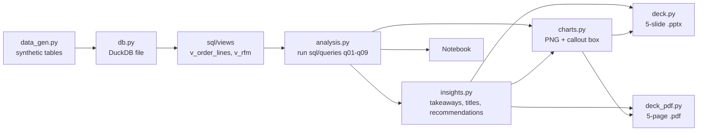

# Architecture

## Modules

| Module        | Role                                                        |
|---------------|-------------------------------------------------------------|
| `config.py`   | Single source of truth for settings, read from env / `.env` |
| `data_gen.py` | Deterministic synthetic customers, products, orders, items  |
| `db.py`       | Builds a fresh DuckDB file and creates views                |
| `analysis.py` | Renders placeholders and runs the SQL files                 |
| `insights.py` | Turns result tables into metric-backed text                 |
| `charts.py`   | Minimalist charts, each with a takeaway callout             |
| `deck.py`     | Builds the executive deck                                   |
| `deck_pdf.py` | Renders the same five slides to PDF with matplotlib         |
| `cli.py`      | `build-db`, `analyze`, `charts`, `deck`, `all`              |

## Design rules

- All business logic lives in SQL; Python only renders and presents.
- Every chart carries a takeaway callout, and every recommendation cites a query source.
- Revenue and profit use completed orders only.
- Synthetic data embeds known patterns (paid social churns more, Electronics has thin margins) so insights are
  verifiable.
